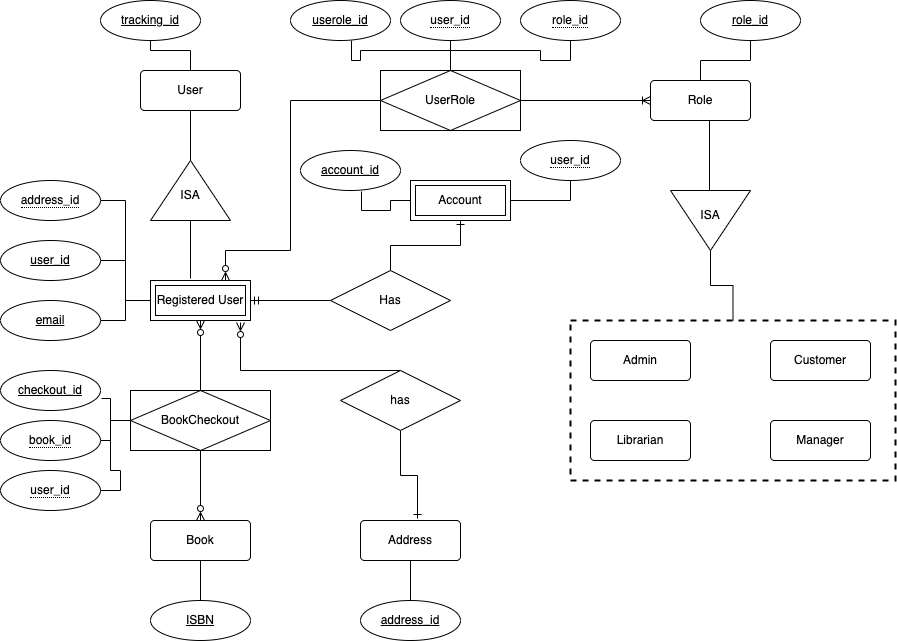

# Milestone 2: Database Conceptual Design (12 points)

In this milestone, students will use the technical information provided in Milestone 1 to build the conceptual design 
of the database (ERD) and to create a detailed description of all the entities in the database.

## Milestone 2: Table of Contents

1. [Section VI: Entity Relationship Diagram (ERD)](#head1)
2. [Section VII: Entity Set Description](#head2)
3. [Grading Rubrics](#head3)
4. [Submission Guidelines](#head4)

### Important Notes
   - Your final version of this milestone must include both your work in M1 and M2.
   - Update your history table with M2. Sort the table in descending order, the newest milestone first.
   - Sections VI and VII may be implemented concurrently.

---

##  Section VI: Entity Relationship Diagram (ERD) (10 points)

Create an Entity Relationship Diagram (ERD) that represents the conceptual high-level design of your relational database
system. This ERD must be created using a software tool that supports diagram creation. For this section, you ***MUST*** 
use [draw.io](https://www.draw.io). ***Note: Hand-drawn diagrams are not allowed.***

> **Note:** As discussed in class, there are several ways to design an ER diagram.
The two most popular notations are Chen's notation and Crow's Foot notation.
While many academic books still use Chen's notation,
it is rarely used in the software industry because it doesn't support some concepts of modern databases.
In this class, we will use Crow's Foot notation, as it has become the standard for modern databases.

Once the ERD is completed, save it as `erd.drawio` and upload it into the ***`files folder`*** in this directory.
Additionally, your ERD must be exported (e.g., PDF, PNG, JPG) and embedded into the technical document created 
for Milestone 1. Screenshots of your ERD are also acceptable, as long as the image is readable and of high quality. 

> **If we cannot read your ERD, or your ERD has fewer than 20 entities, no credit will be given for this section**

Here’s an example of how to create an ERD based on the functional requirements 
provided in Section IV of Milestone 1:

---

##  Section VII: Entity Set Description (2 points)

This section **MUST** be completed concurrently with Section VI because most of the weak and associative entity sets will be 
identified only when the ERD is being implemented. 

When describing your entity sets keep in mind the following policies: 

 + Clearly state whether they are strong or weak and include 
 + At least three attributes per entity. 
 + The attributes must be defined by their domain and type. Below are examples of entity descriptions. 
 + Associative entities must include attributes that provide meaningful information to the user, not just keys.

Here’s an example of how to describe several entity sets based on the functional requirements 
provided in Section IV of Milestone 1:

    1. User (Strong)
      • track_id: strong key, numeric
   
    2. RegisteredUser (Weak)
      • user_id: numeric, primary key
      • email: alphanumeric, unique key
      • address: numeric, foreign key (references Address entity set)
      • name: alphanumeric
      • lastname: alphanumeric
      • fullname: alphanumeric, auto-generated
      • phone_number: alphanumeric, composite and multi-value
      • dob: date, composite
      • age: numeric, derived
 
    3. Address (Strong)
      • address_id: numeric, primary key
      • street: alphanumeric
      • number: numeric 
      • zipcode: numeric 
      • city: alphanumeric
      • state: alphanumeric 
      • country: alphanumeric 
      
    4. Account (Weak)
      • account_id: numeric, primary key 
      • user_id: numeric, primary key and foreign key (references RegisteredUser entity set)
      • created_at: date-time, composite
      • is_validated: BOOLEAN

    5. Book (Strong)
      • ISBN: alphanumeric, primary key
      • title: alphanumeric
      • author: alphanumeric, composite

    6. Role (Strong)
      • role_id: numeric, primary key
      • type: alphanumeric (Admin, Librarian Manager, Librarian or Customer)

    7. UserRole (Associative)
      • userole_id: numeric, primary key
      • user_id: numeric, composite primary key and foreign key (references RegisteredUser entity set)
      • role_id: numeric, composite primary key and foreign key (references Role entity set)
      • expires: date, composite 
      
    8. BookCheckout (Associative)
      • checkout_id: numeric, primary key
      • book_id: alphanumeric, composite primary key and foreign key (references the Book entity set)
      • user_id: numeric, composite primary key and foreign key (references the RegisteredUser entity set)
      • return_date: date, composite
      • amount_fined: numeric

***Note: Give meaningful names to your entities and attributes. For example, 'rid' is not an appropriate attribute name for the role ID.***

---

#  Grading Rubrics 

The following grading rubrics will be used by the TA and the instructor to evaluate the work submitted by students in 
this milestone:

1. ***Completion of Sections***
    
   + All sections of this milestone must be fully completed. Incomplete work or assignments that do not strictly 
     follow the submission guidelines will receive a non-passing grade for this milestone. No exceptions.
   
2. ***AI Detection***

   + Work flagged by our AI detection tools will receive a temporary grade of zero until the issue is resolved. 
   If compelling evidence indicates that the work was created by AI tools like ChatGPT, we will follow university 
   policies regarding academic dishonesty.

3. ***Final Grades***

   + Once a grade is assigned to a milestone, it will not be changed unless the TA or the instructor made an error 
     during the grading process. Read the syllabus policies regarding grade appeal for more details.

4. ***Late Submissions***

   + Late submissions will be subject to penalties. A 10\% deduction will be applied for each day that the 
     assignment is overdue, up to a maximum of three days. After three days, the assignment will be considered as not 
     submitted and will be graded as such.

### Detailed Section Grading

Our TAs will use these grading rubrics to grade your milestone.

#### Sections VI (10 points)
+ (-10 points) are deducted if: 
  + No work or pretty obvious poor work is provided for this section
  + What you submitted for this section is not an ERD. (i.e., UML diagram or EER ...)
  + Your ERD has fewer than the mandatory 20 entities. Recall that the requirement 'at least 20 entities' 
    was a mandatory requirement in milestone 1. Therefore, by extension, it is a mandatory requirement for milestone 2.
+ (-8 points) are deducted if:
  + Your ERD is based on a different system than the one you created in milestone 1
+ (-2 points) are deducted if any of the following relationships are not implemented in your ERD:
  + Many-to-Many
  + One-to-Many
  + Many-to-One
  + One-to-One
  + ISA
  + Aggregation
  + Recursive
+ (-0.5 points) are deducted (per entity) if:
    + An entity set is weak and strong. Note that an entity set can be either strong or weak, but not both.
    + An entity set is not participating in a relationship with another entity set
      (i.e., disconnected entity sets)
    + An entity has a relationship with another entity, but it is not correctly implemented. (in this case -1 point 
      deducted from both entities)
    + An entity was defined in your functional requirements, but it is not implemented as an entity set in your ERD.  
  (milestone 1 section IV)
 

#### Section VII (2 points)

+ (-2 points) are deducted no work or pretty obvious poor work is provided for this section
+ (-0.2 points) are deducted for every entity if:
  + The entity has not a type defined (strong or weak)
  + Attributes' domains and types (if any) are not clearly stated.
  + The entity has fewer than three attributes 
  + All the attribute's keys (if any) are clearly defined (Primary key (PK), Foreign key (FK), and Unique Key (UQ)). 
    Note that defining Check Keys (CHECK) is optional in this milestone. 
  + The entity or/and its attributes do not contain meaningful names that are easy to be read.

> **Grading rubrics are applied consistently to ensure fairness for all students. Every student's work is evaluated 
according to the same criteria outlined in the rubrics. This approach helps maintain objectivity and transparency 
in the grading process.**

---

#   Submission Guidelines

Please carefully follow these submission guidelines for this milestone: 
 
   * ***PDF Submission:*** Upload a PDF file named `m2.pdf` into this directory containing your work for Milestone 2. 
     This file should also include your previous work from Milestones 1, as our technical documentation builds  
     incrementally from one milestone to the next. Only PDF files will be considered for grading. Submissions in any 
     other format will not be graded

   * ***Files Directory:*** Upload `erd.drawio` into the `files` folder located in this directory. Please note that if 
     your file is not found in this directory at the time of grading, it will be considered as not submitted, even if it was mistakenly placed in a different directory.

   * ***On Canvas:*** Use the assignment submission link to provide a URL that links directly to the Milestone 2 folder 
     in your repository.

> **These submission guidelines are essential to ensure fair and consistent grading for everyone. It is crucial that 
your submission strictly follows these instructions. Failure to comply with these guidelines may result in a significant
deduction of points.** 
   
---

🎉 You've nailed milestone 2! Your ERD is now the blueprint of awesomeness, and those entities are ready to party! 🥳📊 Keep the momentum going! 💥
