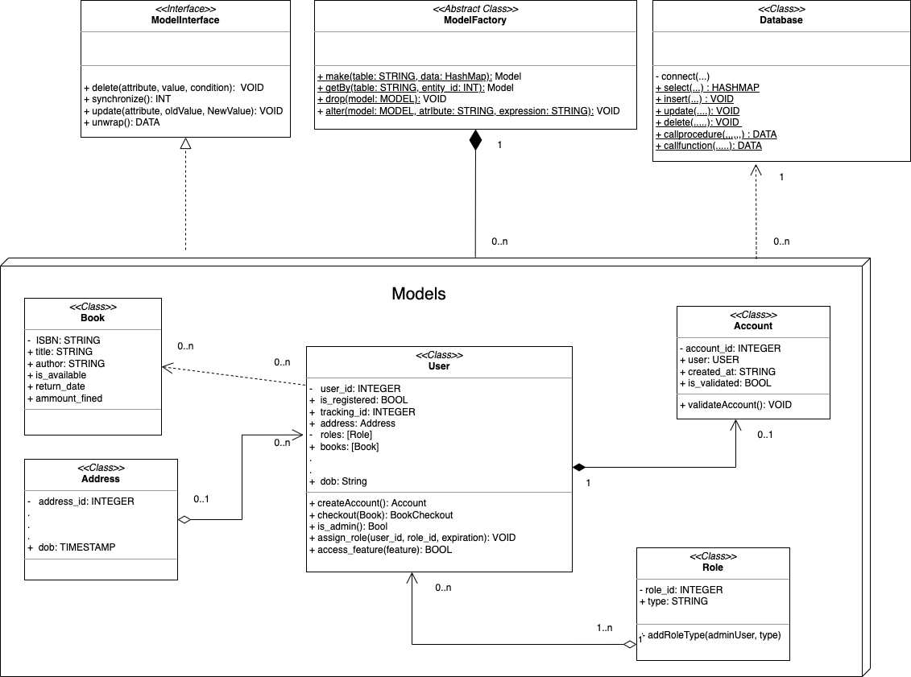

# Milestone 4: Forward Engineering, Sample Data, Business Requirements and ORM Plan (10 points)

In this milestone, students will implement the following components for the database: 

+ Forward Engineering: Creating the database schema 
+ Sample Data: Populating your database with sample data to be used for testing
+ Business Requirements: Solving the most challenging problems for your unique features 
+ ORM Plan: The design and architecture of your Object Relational Model (ORM) implementation. 

## Milestone 4: Table of Contents

1. [Forward Engineering](#head1)
2. [Sample Data](#head2)
3. [Business Requirements](#head3)
4. [Section X: ORM Architecture](#head4)
5. [Grading Rubrics](#head5)
6. [Submission Guidelines](#head6)


## <a id="head1"></a> Forward Engineering (0.5 points)

**Note: this section doesn't require any work to be added to `m4.pdf`**

The forward engineering process is the method by which you convert your database model (EER) into the database schema 
that will be used to create the physical database, including tables and attributes, in your database system. 
This process must be completed using MySQL Workbench, as demonstrated in class. Please note that reverse engineering 
is not permitted in this section.

Before beginning the forward engineering process for your database model, ensure that you assign a meaningful name 
to your database schema. By default, MySQL Workbench assigns the name `mydb.` Replace this with your database name 
followed by "DB" (e.g., `LibraryManagementDB`).

Open your `eer.mwb` file in MySQL Workbench and proceed with the forward engineering process as instructed in class. 
Once completed, save the script file as `databasemodel.sql`. This file must be the direct output of the forward 
engineering process. Any script that contains SQL code different from what MySQL Workbench generates, apart from the 
timestamp, will not be considered for grading. No Exceptions.

Finally, execute the `databasemodel.sql` script to create your database and tables in your system. There are several 
ways to do this, but the most common methods are:

+ Connect to your MySQL instance in Workbench, import the `databasemodel.sql` script, and execute it. Or

+ Connect to your MySQL instance in Workbench, open a SQL script tab windows, and copy and paste the content of 
  `databasemodel.sql` there. Then, click on run. 

+ Run `databasemodel.sql` in both Linux or Windows terminals, with the following command: 

    ```bash
        mysql -u username -p database_name < /path/to/your/databasemodel.sql
    ```

After your database and tables have been created in your MySQL localhost instance, upload the `databasemodel.sql` and 
`eer.mwb` files to the 'files' folder of this directory.

***Note that at grading time your `databasemodel.sql` must run without errors to get credit for this section***

---

## <a id="head2"></a> Populating Database (Sample Data) (0.5 points)

**Note: this section doesn't require any work to be added to `m4.pdf`**

To test your database system, it first needs to be populated with sample data that reflects the scope and domain of the 
business requirements your software product will implement.

### Steps to Populate Your Database:

1. **Create the `inserts.sql` File:**
   - Start by creating a new file named `inserts.sql`.

2. **Add Comments:**
   - Include comments at the top of the file to explain the context and purpose of this file.

3. **Set Your Database Context:**
   - The first SQL command in this file should specify the database you are working with:
     ```mysql
     USE LibrarySystemDB; -- Replace LibrarySystemDB with the name of your database system
     ```

4. **Insert Sample Data:**
   - Add sample data to all your tables. **Each table in your database must have at least three insert statements.**
   - Below is an example of `inserts.sql` sql script for the `LibrarySystemDB` database:

   ```mysql
   -- This file inserts sample data to populate LibrarySystemDB database
   USE LibrarySystemDB;
   
   --  Strong Entities
   
   INSERT INTO User (track_id) VALUES (1001), (1002), (1003); 
   
   INSERT INTO Address (address_id, street, number, zipcode, city, state, country) VALUES 
   (1, 'Maple Street', '123', '90210', 'Beverly Hills', 'CA', 'USA'),
   (2, 'Elm Street', '456', '10001', 'New York', 'NY', 'USA'),
   (3, 'Oak Avenue', '789', '60601', 'Chicago', 'IL', 'USA');
   
   INSERT INTO Book (ISBN, title, author) 
   VALUES 
   ('978-3-16-148410-0', 'The Great Gatsby', 'F. Scott Fitzgerald'),
   ('978-1-4028-9467-7', '1984', 'George Orwell'),
   ('978-0-7432-7356-5', 'To Kill a Mockingbird', 'Harper Lee');
   
   INSERT INTO Role (role_id, type) 
   VALUES 
   (1, 'Admin'),
   (2, 'Librarian Manager'),
   (3, 'Customer'), 
   (4, 'Librarian');
   
   -- Weak Entities
   
   INSERT INTO RegisteredUser (user_id, email, address, name, lastname, fullname, phone_number, dob, age) 
   VALUES 
   (1, 'john.doe@example.com', 1, 'John', 'Doe', 'John Doe', '555-1234', '1990-01-01', 34),
   (2, 'jane.smith@example.com', 2, 'Jane', 'Smith', 'Jane Smith', '555-5678', '1985-05-15', 39),
   (3, 'alice.johnson@example.com', 3, 'Alice', 'Johnson', 'Alice Johnson', '555-9012', '1978-11-30', 45);
   
   INSERT INTO Account (account_id, user_id, created_at, is_validated) 
   VALUES 
   (1, 1, '2024-01-01 10:00:00', TRUE),
   (2, 2, '2024-01-02 11:30:00', TRUE),
   (3, 3, '2024-01-03 14:45:00', FALSE);
   
   INSERT INTO BookCheckout (checkout_id, book_id, user_id, return_date, amount_fined) 
   VALUES 
   (1, '978-3-16-148410-0', 1, '2024-01-15', 0.00),
   (2, '978-1-4028-9467-7', 2, '2024-01-20', 1.50),
   (3, '978-0-7432-7356-5', 3, '2024-01-25', 0.00);
   
   INSERT INTO UserRole (userole_id, user_id, role_id, expires) 
   VALUES 
   (1, 1, 1, '2025-01-01'),
   (2, 2, 2, '2025-01-01'),
   (3, 3, 3, '2025-01-01');
   ``` 

5. **Execute the Script:**
   - Run the `inserts.sql` script in MySQL Workbench or directly in your MySQL instance.  
   **Note:** Your database and tables must already exist in your system before running this script, or it will fail.

6. **Upload the File:**
   - Upload the `inserts.sql` file to the 'files' folder in this directory.

> **Note:** The `inserts.sql` file must run without errors to earn credit for this section

--- 

## <a id="head3"></a> Database Business Requirements  (7 points)

**Note: this section doesn't require any work to be added to `m4.pdf`**

Create and implement five business requirements that align with the unique features described in the product summary 
section from Milestone 1. These requirements must be challenging and should involve:

 + Complex calculations
 + Address real business challenges within the scope of your database
 + Dynamic data management
 + Integration with external systems
 + Maintaining high levels of security and performance based on your non-functional database requirements 
 + Your implementations must be intuitive and user-friendly for the end user.
 + Use all the SQL concepts you have learned in this course to address and solve these business requirements.

Ensure these requirements provide solutions for the challenges outlined in the unique features described in Milestone 1.

### Steps:

1. Create a new file named `business_requirements.sql`.

2. In this file, prepare your business requirements as follows:
  + For each of the business requirements do:
      + State the purpose of the problem to be solved
      + Describe the problem to be solved.
      + Describe the challenges that this problem presents
      + Mention any assumptions that must be considered for this problem.
      + Create your implementation plan
      + Implement your business requirement

3. Upload `business_requirements.sql` file into the `files` folder found in this directory

Below are two examples of business requirements implemented for the `LibrarySystemDB` database:

```mysql
 -- This file provides a SQL based solution to the following database
 -- business requirements for the LibrarySystemDB database
    
 USE LibrarySystemDB;
 
 /*
     Business Requirements #1
     ----------------------------------------------------
     Purpose: Role-Based Access Control with Expiry Dates
     
     Description: The system must implement a role-based access control (RBAC) 
                  mechanism that restricts user access to specific features 
                  based on their assigned roles (e.g., Admin, Librarian Manager, Librarian, Customer). 
                  Each role assignment should have an expiration date, after which the user's access 
                  to the associated features will be automatically revoked. 
     
     Challenge:   This system needs to ensure that role assignments are dynamically checked during each user interaction, 
                  and that expired roles are removed or flagged for renewal. Managing this dynamic access control, 
                  while maintaining security and performance, poses a significant challenge.
     
     Implementation Plan:
        1. Create a stored procedure to assign a role to a user
        2. Create a trigger to revoke expired roles
        3. Create a function to check an active role
        4. Create a stored procedure to access a protected feature
        5. Provide example usage
  
  */
  
  DELIMITER $$
  -- 1 
  CREATE PROCEDURE AssignUserRole( IN p_user_id INT, IN p_role_id INT, IN p_expires DATE)
  BEGIN
      -- Insert a new role assignment for the user
      INSERT INTO UserRole (user_id, role_id, expires)
      VALUES (p_user_id, p_role_id, p_expires);
  END$$ 

 -- 2 
 
 CREATE TRIGGER RevokeExpiredRole
 BEFORE INSERT ON UserRole
 FOR EACH ROW
 BEGIN
     DECLARE v_today DATE;
     SET v_today = CURDATE();
    
    -- Check if the role assignment has already expired
     IF NEW.expires < v_today THEN
        SIGNAL SQLSTATE '45000' 
        SET MESSAGE_TEXT = 'Cannot assign an expired role to the user.';
    END IF;
 END$$

 -- 3
 
 CREATE FUNCTION IsUserRoleActive(p_user_id INT, p_role_id INT)
 RETURNS BOOLEAN
 DETERMINISTIC
 BEGIN
    DECLARE v_is_active BOOLEAN;
    
    -- Check if the user's role is still active
    SELECT COUNT(*) > 0 INTO v_is_active
    FROM UserRole
    WHERE user_id = p_user_id
    AND role_id = p_role_id
    AND expires >= CURDATE();
    
    RETURN v_is_active;
 END$$

-- 4 

 CREATE PROCEDURE AccessFeature(
    IN p_user_id INT,
    IN p_role_id INT
 )
 BEGIN
    DECLARE v_is_active BOOLEAN;
    
    -- Check if the user's role is active
    SET v_is_active = IsUserRoleActive(p_user_id, p_role_id);
    
    IF v_is_active THEN
        -- Proceed with the feature access
        SELECT 'Access Granted' AS Status;
    ELSE
        -- Deny access
        SELECT 'Access Denied: Role has expired or is not assigned' AS Status;
    END IF;
 END$$

 DELIMITER ;

-- 5
 CALL AssignUserRole(1, 2, '2025-01-01');
 CALL AccessFeature(1, 2);

/*
     Business Requirements #2
     ----------------------------------------------------
     Purpose: Comprehensive User Profile Management with Derived Attributes
     
     Description: The system must manage detailed user profiles that include derived attributes, such as age, 
                  and composite attributes like full name and date of birth. Additionally, the system should 
                  allow users to have multiple phone numbers stored as a composite, multi-value attribute. 
     
     Challenge:   The challenge lies in ensuring that derived attributes are automatically updated as base data 
                  changes (e.g., recalculating a user's age on their birthday), and in handling the storage and 
                  retrieval of multi-value attributes efficiently. This requirement demands advanced data modeling 
                  and the implementation of triggers or stored procedures to maintain data integrity. 
     
     Assumptions: None 
     
     Implementation Plan:
        1. Create a Trigger to Automatically Generate 'fullname' and 'age' Attributes by the time the user inserts a
           new registered user. 
        2. Same as in (1) but when the user updates a registered user
        3. Create a View to Simplify Access to User Profiles
        4. Create a Stored Procedure to Update Multiple Phone Numbers
        5. Provide an Example Usage
  
  */

 DELIMITER $$

-- 1 
 CREATE TRIGGER before_user_insert
 BEFORE INSERT ON RegisteredUser
 FOR EACH ROW
 BEGIN
    -- Generate the fullname from the name and lastname
    SET NEW.fullname = CONCAT(NEW.name, ' ', NEW.lastname);
    
    -- Calculate age from the date of birth
    SET NEW.age = YEAR(CURDATE()) - YEAR(NEW.dob);
    
    -- Handle cases where the user's birthday hasn't occurred yet this year
    IF MONTH(NEW.dob) > MONTH(CURDATE()) OR (MONTH(NEW.dob) = MONTH(CURDATE()) AND DAY(NEW.dob) > DAY(CURDATE())) THEN
        SET NEW.age = NEW.age - 1;
    END IF;
 END$$
 
 -- 2
 CREATE TRIGGER before_user_update
 BEFORE UPDATE ON RegisteredUser
 FOR EACH ROW
 BEGIN
    -- Generate the fullname from the name and lastname
    SET NEW.fullname = CONCAT(NEW.name, ' ', NEW.lastname);
    
    -- Calculate age from the date of birth
    SET NEW.age = YEAR(CURDATE()) - YEAR(NEW.dob);
    
    -- Handle cases where the user's birthday hasn't occurred yet this year
    IF MONTH(NEW.dob) > MONTH(CURDATE()) OR (MONTH(NEW.dob) = MONTH(CURDATE()) AND DAY(NEW.dob) > DAY(CURDATE())) THEN
        SET NEW.age = NEW.age - 1;
    END IF;
 END$$
 
 -- 3
 CREATE VIEW UserProfile AS
 SELECT 
    user_id,
    email,
    address,
    fullname,
    phone_number,
    dob,
    age
 FROM RegisteredUser;

-- 4
 CREATE PROCEDURE UpdateUserPhoneNumbers(
    IN p_user_id INT,
    IN p_phone_numbers VARCHAR(255)
 )
 BEGIN
    UPDATE RegisteredUser
    SET phone_number = p_phone_numbers
    WHERE user_id = p_user_id;
 END$$
 
 DELIMITER ;
 
 -- 5
 INSERT INTO RegisteredUser (user_id, email, address, name, lastname, dob, phone_number)
 VALUES (4, 'john.doe@example.com', 1, 'John', 'Doe', '1990-01-01', '555-1234');
 
 CALL UpdateUserPhoneNumbers(4, '555-1234, 555-5678');
 
 SELECT * FROM UserProfile;


```

---

## <a id="head4"></a> Section X: Object-Relational Mapping Architecture (ORM) (2 points)

Create an UML class diagram with [draw.io](https://www.draw.io) that outlines your ORM (Object-Relational Mapping) architecture. This diagram should map each important database
table to a corresponding class in your application, including all attributes with their data types and the relationships 
between classes. Be sure to indicate the multiplicity of relationships (e.g., one-to-one, one-to-many) and how they 
correspond to the foreign key relationships in your database schema.

### Steps: 

1. After the diagram is created, export it to `.png` format and add it to section X in `m4.pdf` 
2. Save your diagram in a file named `orm_uml.drawio` and upload it to the `files`
   folder found in this directory.
    
> **Note: Section X is the final section of the technical documentation (PDF file) for your database.**

Here is an ORM example based on the EER from milestone 3: 



---

# <a id="head5"></a> Grading Rubrics

The following grading rubrics will be used by the TA and the instructor to evaluate the work submitted by students in this milestone:

1. **Completion of Sections**
   - All sections of this milestone must be fully completed. Incomplete work or sections that do not strictly adhere
     to the submission guidelines may negatively impact your final grade for this milestone. No exceptions.

2. **AI Detection**
   - Work flagged by our AI detection tools will receive a temporary grade of zero until the issue is resolved. 
     If compelling evidence indicates that the work was created by AI tools like ChatGPT, we will follow university policies regarding academic dishonesty.

3. **Final Grades**
   - Once a grade is assigned to a milestone, it will not be changed unless the TA or instructor made an error during 
    the grading process. Please refer to the syllabus for details on grade appeals.

4. **Late Submissions**
   - Late submissions will incur penalties. A 10% deduction will be applied for each day the assignment is overdue, up 
   to a maximum of three days. After three days, the assignment will be considered as not submitted and will be graded as such.

### Detailed Section Grading

Our TAs will use the following rubrics to grade your milestone:

#### Forward Engineering (0.5 points)
- **(-0.5 points)** will be deducted if your `databasemodel.sql` sql script: 
    - Is not found in the `files` folder.
    - Contains differences between your `databasemodel.sql` schema and the one we generate through forward engineering from your EER.
    - The file generates errors upon execution.
  
    + **Steps we will use to test your `databasemodel.sql` file:**
       1. We will forward engineer your `eer.mbw` database model, creating a file named `databasemodel1.sql`.
       2. We will open your `databasemodel.sql`, copy the SQL code you used to drop, create, and use your database, 
          and paste these lines into our `databasemodel1.sql` file.
       3. We will run the following bash command in a Linux terminal:
       ```bash
        diff databasemodel.sql databasemodel1.sql
       ```
       4. To pass this test, the only difference we should observe between these two files after executing the above 
          command is the timestamp, which is automatically included by MySQL Workbench during the forward engineering process.
       5. We will execute your `databasemodel.sql` file in our MySQL instance. It should create your database and 
          tables in our system without any errors.

#### Populating the Database (Sample Data) (0.5 points)    

- **(-0.5 points)** are deducted if your `inserts.sql` sql script: 
    - Is not found in the `files` folder.
    - Does not follow the minimum requirements outlined for this section 
     (i.e., missing insertions for some tables, or fewer than three insertions per table)
    - The file generates errors upon execution.

#### Database Business Requirements (7 points) 

- **(-7 points)** are deducted if your `business_requirements.sql` sql script: 
    - Is not found in the `files` folder.
    - Does not follow the minimum requirements outlined for this section 
     (i.e., implemented fewer than five business requirements)
    - The file generates errors upon execution.
- **(-1.4 points)** are deducted (per business requirement) if:
    - The business requirement doesn't adhere to the following format: 
      + Purpose
      + Description
      + Challenge 
      + Assumptions (if any)
      + Implementation plan
    - The business requirement is not properly implemented (e.g., incorrect logic or suboptimal choice of SQL stored components).


#### Section X: Object-Relational Mapping Plan (ORM) (2 points)

- **(-2 points)** are deducted if: 
    - Your `orm_uml.drawio` file is not found in the `files` folder located in this directory.
    - Your `m4.pdf` does not include the work required for this section.
    - Your diagram is not a UML diagram 
    - Your ORM implementation doesn't follow the processes learned during lectures for this topic
- **(-1 point)** is deducted for incorrect logic, or suboptimal choice of relationships between the models 
    representing your tables in the UML diagram provided

> **Grading rubrics are applied consistently to ensure fairness for all students. Every student's work is evaluated
according to the same criteria outlined in the rubrics. This approach helps maintain objectivity 
and transparency in the grading process.**

---

# <a id="head6"></a> Submission Guidelines

Please carefully follow these submission guidelines for this milestone: 

  * ***PDF Submission:*** Upload a PDF file named `m4.pdf` into this directory containing your work for Milestone 4. 
     This file should also include your previous work from Milestones 1, 2, and 3, as our technical documentation builds  
     incrementally from one milestone to the next. Only PDF files will be considered for grading. Submissions in any 
     other format will not be graded. The only section in Milestone 4 that must have work included in the `m4.pdf` file is Section X.

   * ***Files Directory:*** Upon completing this milestone, the `files` folder found in this directory must include 
        the following files:
      + `databasemodel.sql` 
      + `inserts.sql`
      + `business_requirements.sql`
      + `eer.mwb` (from milestone 3)
      + `orm_uml.drawio`
      
     Please note that if your files are not found in this directory at the time of grading, it will be considered 
     as not submitted, even if it was mistakenly placed in a different directory.

   * ***On Canvas:*** Use the assignment submission link to provide a URL that links directly to the Milestone 4 folder 
     in your repository.

> ***These submission guidelines are essential to ensure fair and consistent grading for everyone. It is crucial that 
your submission strictly follows these instructions. Failure to comply with these guidelines may result in a significant
deduction of points.*** 


--- 

🎉 Congrats! You've hit the jackpot! You’ve engineered your database like mad scientists, 
stuffed it with data like it’s Black Friday, nailed those business requirements like pro, and mapped your 
ORM plan like it’s a treasure hunt! 💰🏴‍☠️


